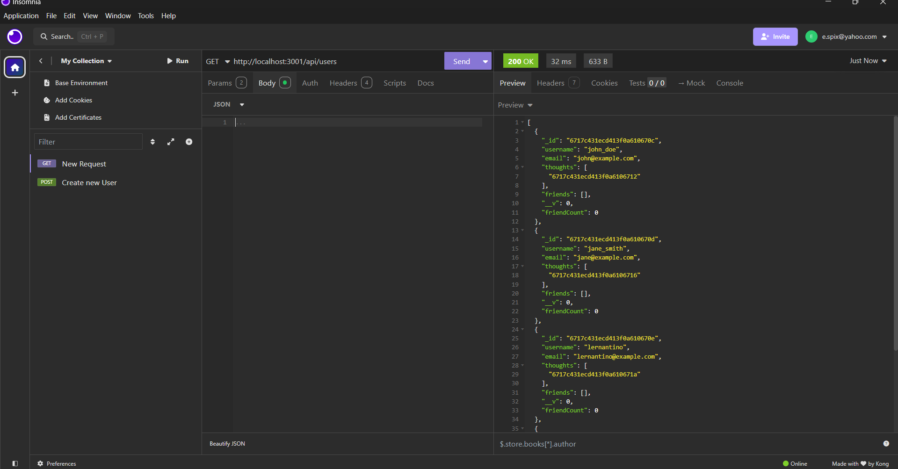
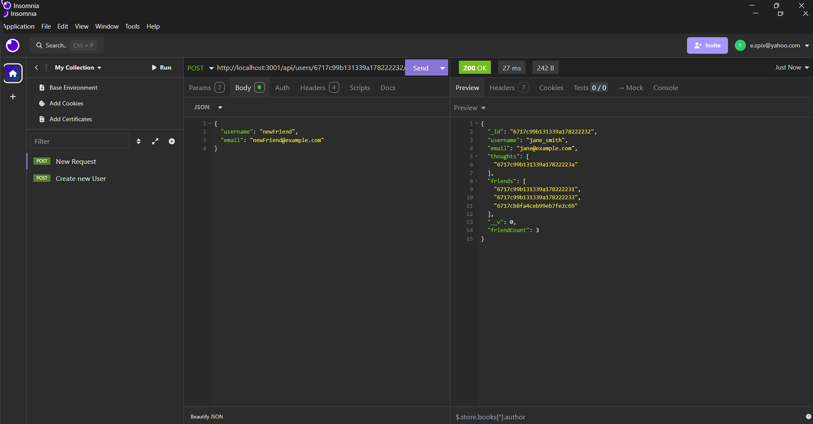
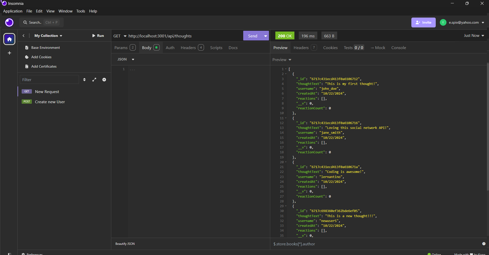
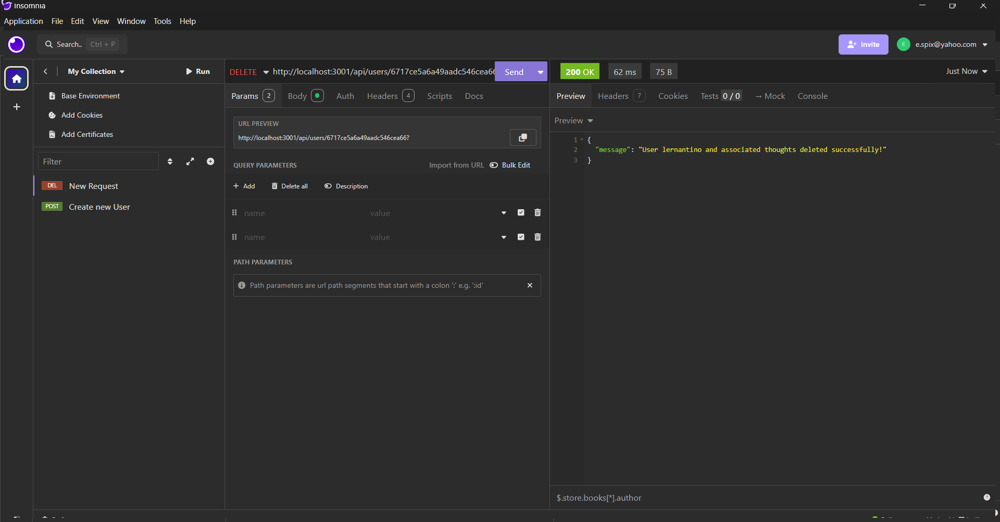

# Social Network API

## Description
The Social Network API is designed for a social network application where users can share their thoughts, react to friends' thoughts, and manage a list of friends. Built using Express.js for routing, MongoDB as the database, and Mongoose as the ODM, this API provides a robust foundation for handling unstructured data and managing complex relationships between users, thoughts, and reactions.

## Table of Contents

- [Description](#description)
- [Installation](#installation)
- [Usage](#usage)
- [License](#license)
- [Contributing](#contributing)
- [Tests](#tests)
- [Questions](#questions)

## Installation

*Clone the repository** to your local machine:
https://github.com/erinspix/NoSQL-Challenge-Social-Network-API.git
Install Dependancies:
npm install
mongod
npm run seed
## Usage
run in terminal,

npm start

Usage
Use Insomnia or Postman to test the API endpoints:

Users: Create, read, update, delete users and manage friends.
Thoughts: Create, read, update, delete thoughts.
Reactions: Add and remove reactions to thoughts.
Basic API Endpoints
Users:

GET /api/users - Retrieve all users.
POST /api/users - Create a new user.
GET /api/users/:userId - Get a user by ID.
PUT /api/users/:userId - Update a user by ID.
DELETE /api/users/:userId - Delete a user by ID.
POST /api/users/:userId/friends/:friendId - Add a friend to the user's friend list.
DELETE /api/users/:userId/friends/:friendId - Remove a friend from the user's friend list.
Thoughts:

GET /api/thoughts - Retrieve all thoughts.
POST /api/thoughts - Create a new thought.
GET /api/thoughts/:thoughtId - Get a thought by ID.
PUT /api/thoughts/:thoughtId - Update a thought by ID.
DELETE /api/thoughts/:thoughtId - Delete a thought by ID.
Reactions:

POST /api/thoughts/:thoughtId/reactions - Add a reaction to a thought.
DELETE /api/thoughts/:thoughtId/reactions/:reactionId - Remove a reaction by ID.
## License

This project is licensed under the MIT license.
For more details, see: [MIT](https://opensource.org/licenses/MIT)

## Contributing

 feel free to fork the project and make it your own
## Tests

Use Insomnia to test the API endpoints:

Start the server.
Send GET, POST, PUT, and DELETE requests to the endpoints.
Verify responses and data persistence in MongoDB.
Example Tests
Add a User: Send a POST request to /api/users with a JSON body containing "username" and "email".
Add a Thought: Send a POST request to /api/thoughts with "thoughtText", "username", and "userId" fields.
Add a Reaction: Send a POST request to /api/thoughts/:thoughtId/reactions with "reactionBody" and "username".

## Questions

For any questions, please contact me with the information below:

GitHub: [erinspix](https://github.com/erinspix)  
Email: e.spix@yahoo.com

- **Insomnia Tests**:
USER ROUTE
 
NEW FRIEND
 
THOUGHT ROUTE
 
DELETE
 

Demo:
https://drive.google.com/file/d/1TWRRcb7A1oicgfvb6cssxO3sdgysodxs/view?usp=sharing